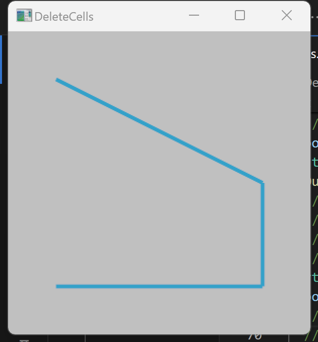
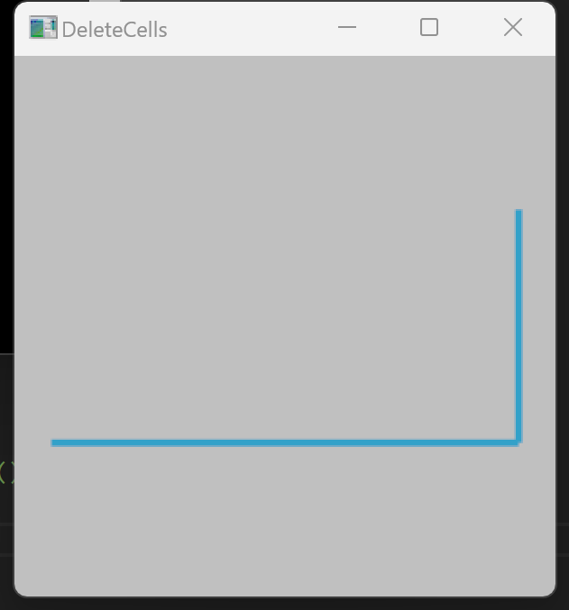

# VTK Delete Cells/Points

## Delete Cells

```
 // Mark a cell as deleted.
  polydata->DeleteCell(0);
  // Remove the marked cell.
  polydata->RemoveDeletedCells();
```


## Delete Points

First we build a polydata with four points and line cells, and buildlinks:



1. Use  polydata->DeletePoint(deletePointId);

- in vtkCellLinks.h:

  ```
  //----------------------------------------------------------------------------
  inline void vtkCellLinks::DeletePoint(vtkIdType ptId)
  {
    this->Array[ptId].ncells = 0;
    delete[] this->Array[ptId].cells;
    this->Array[ptId].cells = nullptr;
  }
  
  ```

  The DeletePoint() deletes cells links to the point, so you have to call DeletePoint() before DeleteCell() to avoid seg fault

- After calling DeletePoint() properly, the cell could been successfully deleted, but when you output the points, you still get:

  ```
  $ ./DeleteCells.exe
  Number of points: 4
  0 0 0
  1 0 0
  1 0.5 0
  0 1 0
  Number of points: 4
  0 0 0
  1 0 0
  1 0.5 0
  0 1 0
  ```

  


